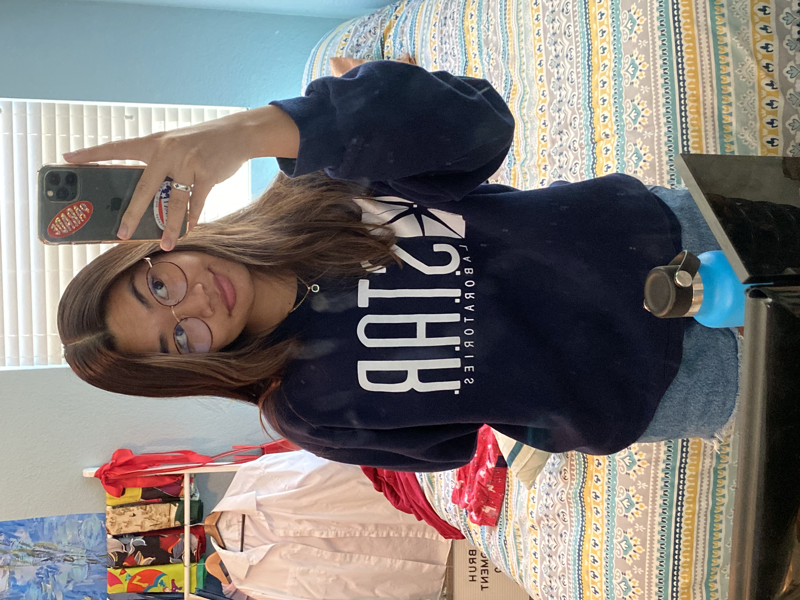

# practice-alex-h
first repl

hi, i'm alex hernandez, and i'm from temecula, california!! i love politics, fashion, stem (computer science ofc), music (esp rap/hiphop and rnb), and traveling!
some things i hope to learn from SPIS is how to code proficiently in python, as well as creating simple solutions to complex problems :) i'm super exicted
to begin this course and i can't wait to explore more about cse<3!

